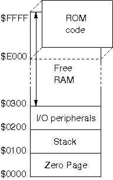

https://digicoolthings.com/building-a-6502-and-w65c02-nop-tester/

http://www.6502.org/tutorials/6502opcodes.html#JSR

## 인터럽트 (Interrupt) — CPU를 "끼어들기"하는 신호

NES의 CPU(6502)는 세 가지 방법으로 실행 흐름이 바뀔 수 있다.

### IRQ — Interrupt ReQuest (maskable interrupt)

- **누가 보내나?** APU 프레임 카운터, 일부 매퍼 (e.g., MMC3)
- **특징:** *maskable* — CPU status의 **I 플래그**가 1이면 무시할 수 있음
- **언제 쓰이나?** 오디오 타이밍, 매퍼가 특정 스캔라인에서 IRQ를 거는 용도

### NMI — Non-Maskable Interrupt

- **누가 보내나?** **PPU** — VBlank 진입 시
- **특징:** *non-maskable* — I 플래그와 상관없이 **무조건 처리**해야 함
- **언제 쓰이나?** 매 프레임의 수직 귀선(VBlank) 시작을 CPU에게 알림 → 게임 코드가 여기서 PPU 업데이트를 함

### RESET

- **누가 보내나?** 누가 라기보단.. 전원을 켜거나 리셋버튼을 눌렀을떄 발동된다.

### 인터럽트 발생 시 6502가 하는 일 (공통 흐름)

1. 현재 **PC**(다음 명령어 주소)를 스택에 push
2. 현재 **status** 레지스터를 스택에 push
3. **I 플래그** 세트 (이후 추가 IRQ 차단)
4. 특정 **벡터 주소**에서 핸들러 주소를 읽어 PC를 변경

| 인터럽트 | 벡터 주소   |
| -------- | ----------- |
| NMI      | $FFFA/$FFFB |
| RESET    | $FFFC/$FFFD |
| IRQ/BRK  | $FFFE/$FFFF |

`0xFD : 0000 0000 1111 1101`

### NES에서 NMI의 실제 흐름

PPU가 scanline 241, dot 1에 도달
    → PPUSTATUS의 vblank 비트 세트
    → PPUCTRL의 NMI enable 비트가 1이면 → CPU에 NMI 신호 전송
        → CPU는 다음 명령어 실행 전에 NMI 처리
            → $FFFA/$FFFB 에서 핸들러 주소 읽기
                → 게임의 VBlank 루틴 실행

----

## `JSR`
* JSR의 다음 명령의 주소 -1을 저장한다.

```
$8000: 20        ; JSR opcode
$8001: 00        ; 목적지 주소 low
$8002: C1        ; 목적지 주소 high
$8003: ...       ; 다음 명령어 ← 진짜 돌아와야 할 곳
```

## `RTS`
```
1. 스택에서 $8002 꺼냄
2. +1 → $8003
3. PC = $8003 으로 점프
```

---

## 메모리 구조

<div align=center>
    
    <h5></h5>
</div>

```
$01FF ← 스택 시작점 (가장 높은 주소)
$01FE
$01FD ← 리셋 후 SP가 여기를 가리킴
  ...    (푸시할수록 아래로)
$0100 ← 스택 끝 (가장 낮은 주소)
```
