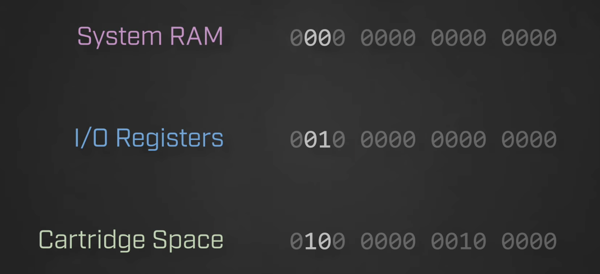
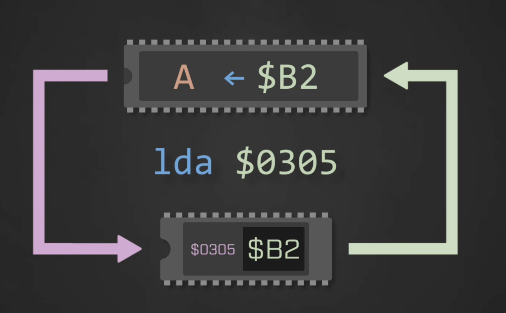

#### CPU 버스 모듈은 PPU 버스의 존재를 모르고, PPU 버스 모듈은 CPU 버스의 존재를 모릅니다.

### MMIO (Memory Mapped I/O)
CPU는 Memory-Mapped I/O를 통한 PPU의 VRAM(SRAM)에 접근할 수 있다.

이로서 VRAM의 네임 테이블과 팔레트 조작에 사용 가능하다.
VRAM은 또한 미러링 동작과도 관련이 있다.

CPU가 "CPU Work RAM(SRAM) "$2000–$2007에 읽기/쓰기를 하면, 그 요청이 PPU 레지스터로 라우팅됩니다.

* PPUCTRL   `$2000` :
* PPUMASK   `$2001` :
* PPUSTATUS `$2002` :
* PPUDATA   `$2006` :
* PPUADDR   `$2007` :

#### 메모리 공간을 하드웨어에 대응되는 지역을 세그먼트로 나눈..

Address 자체가 어떤 하드웨어에 가할 대한 연산인지 알 수 있다.
* | `$0000` : SRAM | `$2000` : PPU/APU 등.. I/O 레지스터 | `$4020` : 카트리지 |
* 0000 | XXXX | XXXX | XXXX : `0x0XXX`
* 0010 | XXXX | XXXX | XXXX : `0x2XXX`
* 0100 | XXXX | XXXX | XXXX : `0x4XXX`

* 이를 통해 Address로 Address Bus를 통해
어떤 위치의 데이터를 Read할지 정보를 가져오고
* 그게 끝났다면 Data Bus & Control Bus를 통해 Read/Write 두 동작중 하나를 수행한다.
